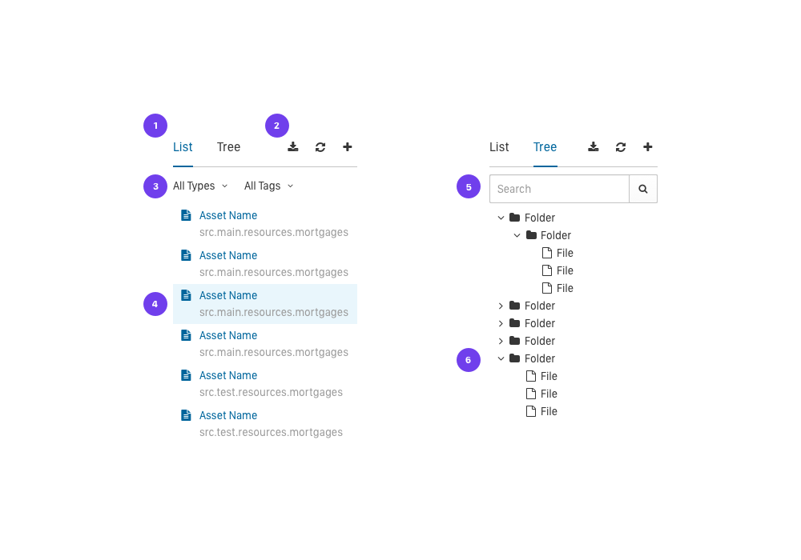

# Project Explorer

1. **Tabs:** The two different views are now tabs.
2. **Actions:** Download, Refresh and New Asset. Icons TBD, not sure if Download and Refresh are necessary.
3. **Filter:** Filter the flat list of assets by type and/or tag.
4. **Location:** Because this is a flat list, second line indicates actual location.
5. **Search:** An alternative to Filter (3 above).
6. **Expand:** Ability to open more than one folder at a time.
